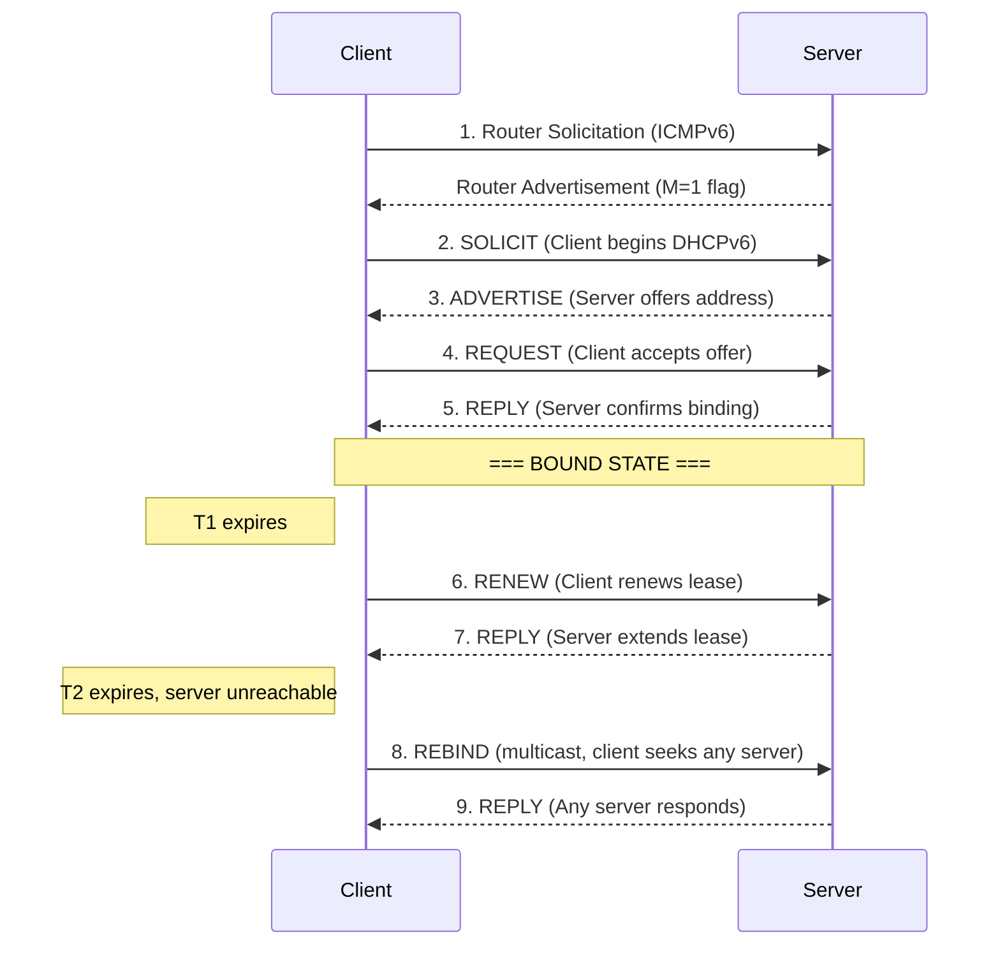
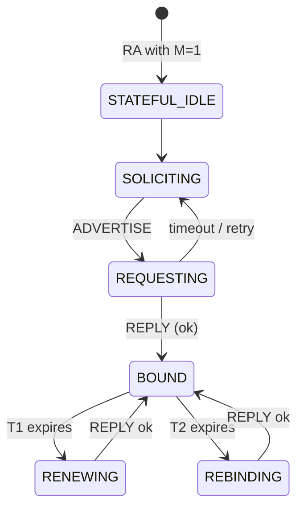

# Stateful DHCPv6 Support in lwIP

## Overview

This document describes the design and implementation of stateful DHCPv6 (RFC 8415) support in our lwIP 2.2.1 network stack, including DHCPv6 Option 59 (Boot File URL, RFC 5970) for IPv6 network boot. This work enables the Network Boot Coprocessor to acquire IPv6 addresses and discover boot resources over IPv6 networks using standard DHCPv6 infrastructure.

### Motivation

Our lwIP 2.2.1 stack only supports **stateless** DHCPv6 (RFC 3736), which provides configuration parameters (DNS servers, NTP, etc.) but **not** address assignment. For IPv6 network boot, we need **stateful** DHCPv6 to:

1. **Acquire a global IPv6 address** — Stateful DHCPv6 assigns a routable IPv6 address to the network interface, required for TFTP communication.
2. **Discover the boot file location** — DHCPv6 Option 59 (Boot File URL) provides the TFTP server address and boot file path in a single URL, analogous to BOOTP fields in DHCPv4.
3. **Maintain lease state** — Proper T1/T2 renewal timers and lease management ensure the address remains valid during the boot process.

### Scope

- Patch lwIP 2.2.1 C sources (3 files, ~1000 lines added)
- All new code gated behind `LWIP_IPV6_DHCP6_STATEFUL` (compile-time)
- No changes to the stateless DHCPv6 code path
- No external dependencies beyond existing lwIP infrastructure

---

## DHCPv6 Protocol Background

### Stateless vs. Stateful DHCPv6

| Feature | Stateless (RFC 3736) | Stateful (RFC 8415) |
|---|---|---|
| Address assignment | No (uses SLAAC) | Yes (server assigns addresses) |
| Configuration (DNS, NTP, etc.) | Yes | Yes |
| Lease management | No | Yes (T1, T2, valid/preferred lifetimes) |
| Router Advertisement flag | O flag (Other Config) | M flag (Managed Address Config) |
| Message exchange | 2-message (Info-Request → Reply) | 4-message (Solicit → Advertise → Request → Reply) |

### Stateful DHCPv6 Message Flow

The stateful DHCPv6 4-message exchange (SARR) works as follows:



### Key DHCPv6 Concepts

- **DUID (DHCP Unique Identifier)**: Identifies the client. We use DUID-LL (Link-Layer Address) — the simplest form.
- **IA_NA (Identity Association for Non-temporary Addresses)**: Container for the assigned IPv6 address and its lifetimes.
- **IAID (Identity Association Identifier)**: Unique ID for each IA, derived from the interface index.
- **T1/T2 Timers**: T1 is the renewal time (unicast RENEW to server), T2 is the rebinding time (multicast REBIND to any server).
- **Preferred/Valid Lifetimes**: Per-address lifetimes from the IAADDR sub-option within IA_NA.
- **ORO (Option Request Option)**: Lists which options the client wants the server to include in the reply.
- **Option 59 (Boot File URL)**: RFC 5970 option containing a URL like `tftp://[fd00::1]/boot.bin` that specifies the TFTP server and boot file path.

### DHCPv6 State Machine



---

## Implementation: lwIP Patch

### Architecture

All stateful DHCPv6 code is gated behind `#if LWIP_IPV6_DHCP6_STATEFUL`, which defaults to `0` in lwIP's `opt.h`. This ensures:

- Zero impact on existing stateless DHCPv6 users
- No code-size increase when the feature is disabled
- The patch cleanly separates stateful and stateless codepaths

### Files Modified

| File | Changes | Description |
|---|---|---|
| `src/include/lwip/prot/dhcp6.h` | +12 lines | New states, Option 59/60 defines |
| `src/include/lwip/dhcp6.h` | +32 lines | `struct dhcp6` fields for stateful state |
| `src/core/ipv6/dhcp6.c` | +976 lines | Full stateful client implementation |

### 1. Protocol Definitions (`prot/dhcp6.h`)

**New DHCPv6 states** added to `dhcp6_state_enum_t`:

| State | Value | Description |
|---|---|---|
| `DHCP6_STATE_STATEFUL_IDLE` | 3 | Stateful enabled, waiting for RA with M flag |
| `DHCP6_STATE_SOLICITING` | 4 | Sending SOLICIT, waiting for ADVERTISE |
| `DHCP6_STATE_REQUESTING` | 5 | Sending REQUEST, waiting for REPLY |
| `DHCP6_STATE_BOUND` | 6 | Address acquired and active |
| `DHCP6_STATE_RENEWING` | 7 | T1 expired, sending RENEW to server |
| `DHCP6_STATE_REBINDING` | 8 | T2 expired, sending REBIND to any server |

**New option defines**:
- `DHCP6_OPTION_BOOTFILE_URL` (59) — RFC 5970 Boot File URL
- `DHCP6_OPTION_BOOTFILE_PARAM` (60) — RFC 5970 Boot File Parameters

### 2. Client State (`dhcp6.h`)

New fields added to `struct dhcp6` under `#if LWIP_IPV6_DHCP6_STATEFUL`:

```c
/* Client identity */
u8_t duid[4 + NETIF_MAX_HWADDR_LEN];  // DUID-LL
u8_t duid_len;

/* Server identity (from ADVERTISE) */
u8_t server_duid[128];
u16_t server_duid_len;
u8_t server_pref;                       // Server preference value

/* IA_NA state */
u32_t ia_id;                            // Identity Association ID
ip6_addr_t ia_addr;                     // Assigned IPv6 address
u32_t preferred_lifetime;
u32_t valid_lifetime;
u32_t t1, t2;                          // Renewal/rebinding times (seconds)

/* Timer ticks (in DHCP6_TIMER_MSECS units) */
u32_t t1_timeout, t2_timeout, lease_timeout;

/* Retransmission (RFC 8415 §15) */
u32_t rt_msecs;                         // Current retransmit timeout
u32_t elapsed_msecs;                    // Elapsed time for current exchange

/* Address management */
s8_t addr_idx;                          // Netif address slot index (-1 = none)

/* Boot File URL (Option 59) */
char boot_file_url[128];
u8_t boot_file_url_len;
```

### 3. Core Implementation (`dhcp6.c`)

#### DUID Generation

```
dhcp6_enable_stateful(netif)
  └─> Generates DUID-LL: [type=3(LL), hwtype=1(Ethernet), MAC address]
  └─> Sets IA_ID from interface number
  └─> Transitions to STATEFUL_IDLE state
```

#### Message Construction

Each outgoing message includes these options built by helper functions:

| Helper | Option | Description |
|---|---|---|
| `dhcp6_option_clientid()` | Client ID (1) | Our DUID-LL |
| `dhcp6_option_serverid()` | Server ID (2) | Server's DUID (from ADVERTISE) |
| `dhcp6_option_elapsed_time()` | Elapsed Time (8) | Time since exchange started |
| `dhcp6_option_ia_na()` | IA_NA (3) | IAID + T1/T2 (12 bytes) |
| `dhcp6_option_optionrequest()` | ORO (6) | Requested options: DNS, Boot File URL |

#### Message Senders

| Function | Message | When |
|---|---|---|
| `dhcp6_solicit()` | SOLICIT | RA received with M=1 |
| `dhcp6_stateful_request()` | REQUEST | After selecting server from ADVERTISE |
| `dhcp6_renew()` | RENEW | T1 timer expires (unicast to server) |
| `dhcp6_rebind()` | REBIND | T2 timer expires (multicast) |

#### Reply Processing

**ADVERTISE handling** (`dhcp6_handle_advertise`):
- Validates Client ID matches our DUID
- Checks top-level Status Code
- Extracts server DUID and preference value
- If preference == 255, immediately selects this server (fast path per RFC 8415)
- Otherwise stores the best server and transitions to REQUESTING

**REPLY handling** (`dhcp6_handle_stateful_reply`):
- Validates Client ID and Server ID
- Checks Status Code (restarts SOLICIT on failure)
- Parses IA_NA with nested IAADDR sub-options via `dhcp6_parse_ia_na_options()`
- Extracts assigned address, preferred/valid lifetimes, and T1/T2
- Installs address on the netif with DAD (Duplicate Address Detection)
- Computes T1/T2 defaults if server sends 0 (RFC 8415: T1=0.5×preferred, T2=0.8×preferred)
- Converts lease times to timer ticks
- Extracts Boot File URL from Option 59 if present
- Processes DNS options (reuses stateless handler)

#### Retransmission (RFC 8415 §15)

```
RT = IRT + RAND*IRT                    (first transmission)
RT = 2*RTprev + RAND*RTprev            (subsequent)
RT = min(RT, MRT)                      (cap at maximum)
```

Where RAND is a random factor in [-0.1, +0.1] range. Parameters per message type:

| Message | IRT | MRT | MRC |
|---|---|---|---|
| SOLICIT | 1s | 3600s (SOL_MAX_RT) | 0 (infinite) |
| REQUEST | 1s | 30s | 10 |
| RENEW | 10s | 600s | 0 |
| REBIND | 10s | 600s | 0 |

#### Timer Management (`dhcp6_tmr`)

The existing 500ms timer (`dhcp6_tmr`) is extended for stateful states:

- **BOUND**: Decrements T1, T2, and lease timeouts. Transitions to RENEWING at T1, REBINDING at T2, restarts SOLICIT at lease expiry.
- **RENEWING/REBINDING**: Decrements remaining timers and handles transitions.

#### RA Trigger (`dhcp6_nd6_ra_trigger`)

Modified to detect the M (Managed Address Configuration) flag in Router Advertisements:
- M=1 and stateful is `STATEFUL_IDLE` → start SOLICIT
- M=0 → existing stateless O-flag handling (unchanged)

### 4. Option 59 — Boot File URL (RFC 5970)

Option 59 carries a URL string identifying the boot file location. The format is:

```
tftp://[<ipv6-address>]/<file-path>
```

**Server side**: The DHCPv6 server (e.g., dnsmasq) sends Option 59 in ADVERTISE and REPLY messages. With dnsmasq, this is configured via:
```
--dhcp-option=option6:59,tftp://[fd00:1234:5678::1]/boot.bin
```

**Client side**: Our implementation:
1. Requests Option 59 in the ORO of SOLICIT and REQUEST messages
2. Parses the option value from REPLY and stores it in `dhcp6->boot_file_url[]`
3. The Rust API exposes `boot_file_url()` (raw URL) and `parse_boot_file_url()` (parsed into server address + file path)

---


### Example Application Flow

```
1. init() — Initialize lwIP
2. NetIf::new_tap() — Create network interface
3. create_ipv6_linklocal() — Generate link-local address
4. Dhcp6Client::new() + start() — Begin stateful DHCPv6
5. Poll loop:
   a. Wait for global IPv6 address (has_address())
   b. Extract TFTP server + path from Option 59 (parse_boot_file_url())
   c. TftpClient::get_v6(server, path) — Download boot file
6. Verify downloaded file
```

---

## Configuration

### Compile-Time Options

| Option | File | Default | Description |
|---|---|---|---|
| `LWIP_IPV6_DHCP6` | `opt.h` | 0 | Enable DHCPv6 (stateless or stateful) |
| `LWIP_IPV6_DHCP6_STATEFUL` | `opt.h` | 0 | Enable stateful DHCPv6 (requires `LWIP_IPV6_DHCP6`) |
| `LWIP_DHCP6_PROVIDE_DNS_SERVERS` | `opt.h` | 0 | Parse DNS server options from DHCPv6 |

For host builds (TAP-based testing), our `lwipopts.h` sets:
```c
#define LWIP_IPV6_DHCP6          1
#define LWIP_IPV6_DHCP6_STATEFUL 1
```

## References

- [RFC 8415](https://datatracker.ietf.org/doc/html/rfc8415) — Dynamic Host Configuration Protocol for IPv6 (DHCPv6)
- [RFC 5970](https://datatracker.ietf.org/doc/html/rfc5970) — DHCPv6 Options for Network Boot
- [RFC 3646](https://datatracker.ietf.org/doc/html/rfc3646) — DNS Configuration Options for DHCPv6
- [lwIP 2.2.1](https://savannah.nongnu.org/projects/lwip/) — Lightweight IP stack
- [dnsmasq](https://thekelleys.org.uk/dnsmasq/doc.html) — Lightweight DHCP/TFTP server
