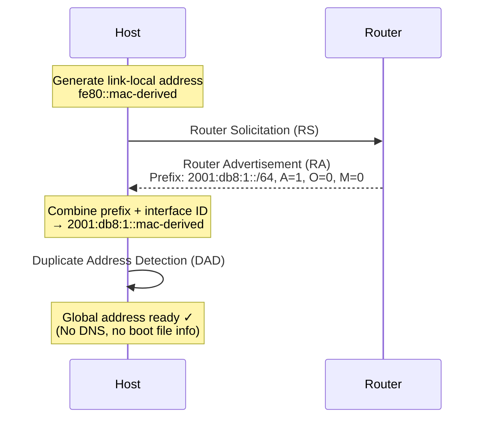
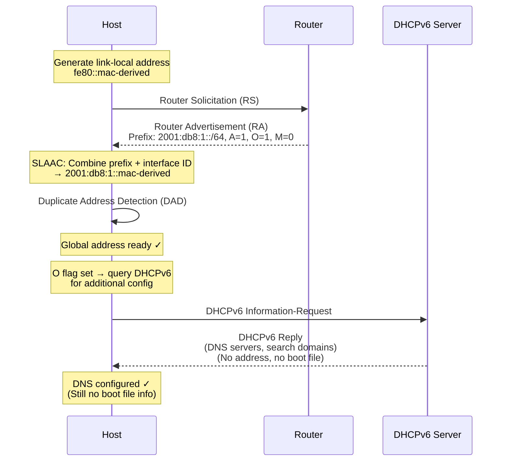
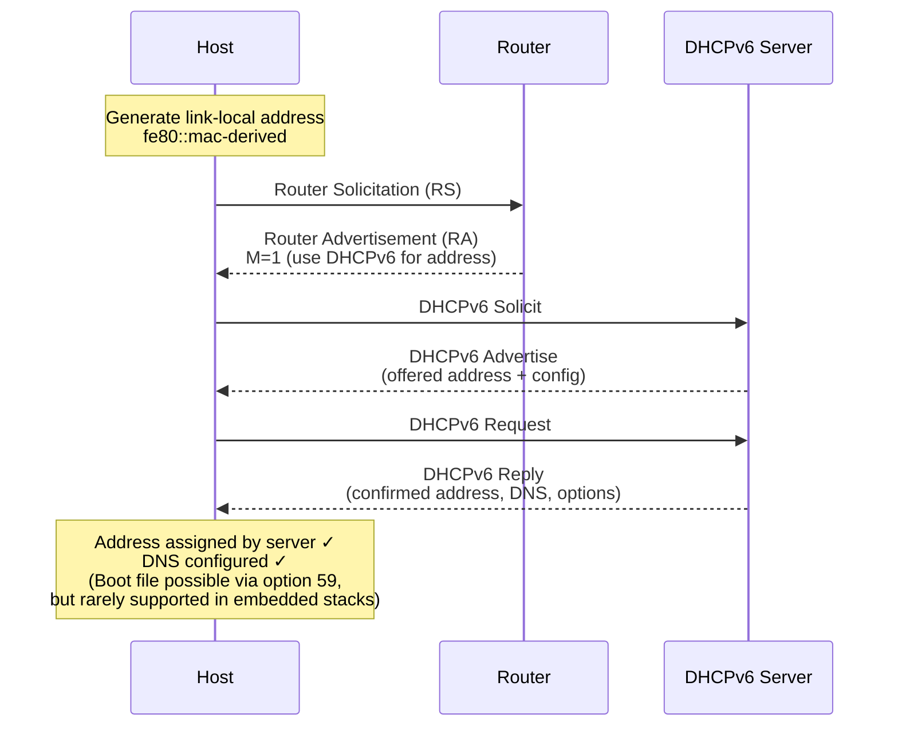
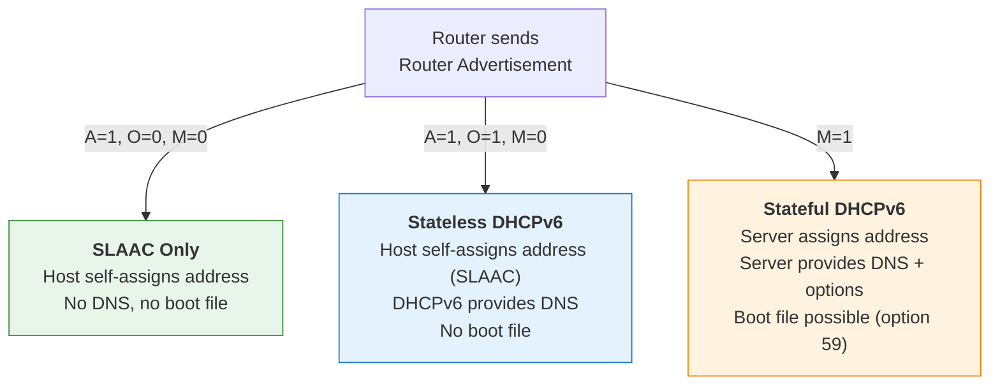
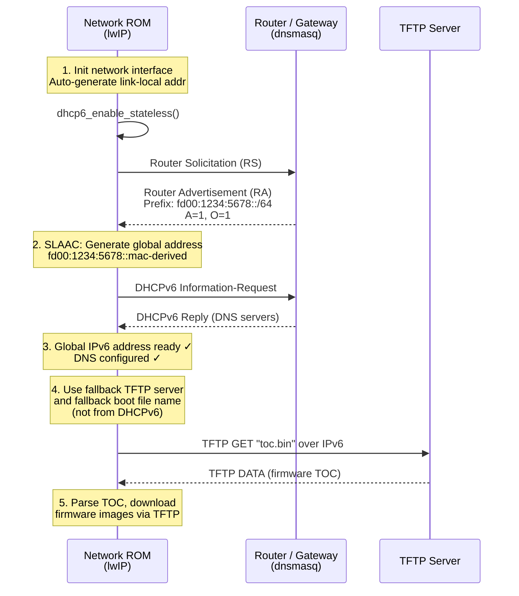
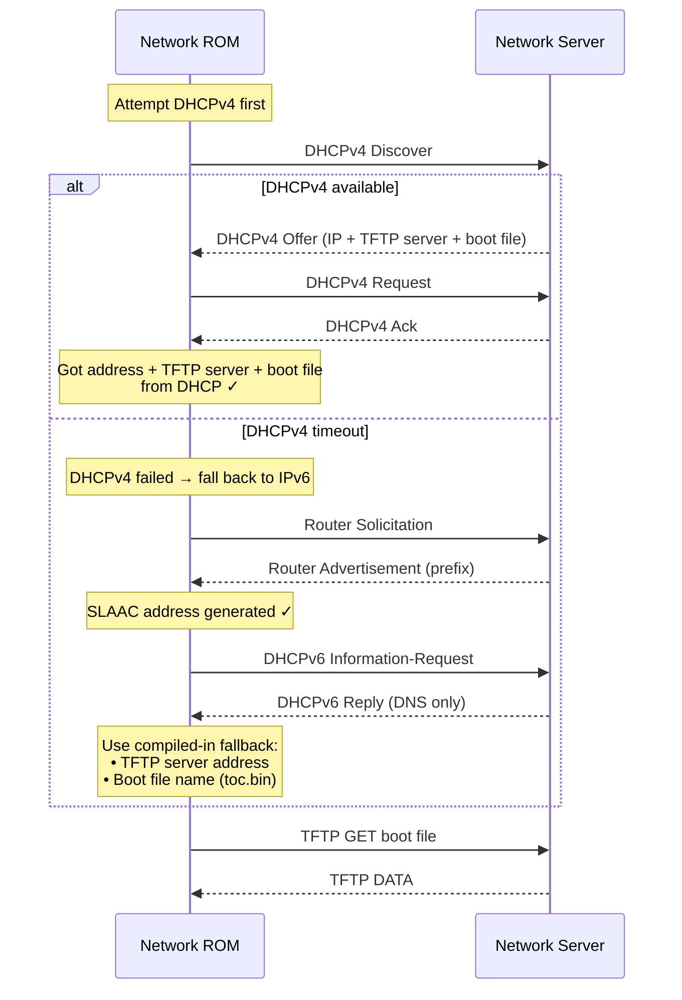
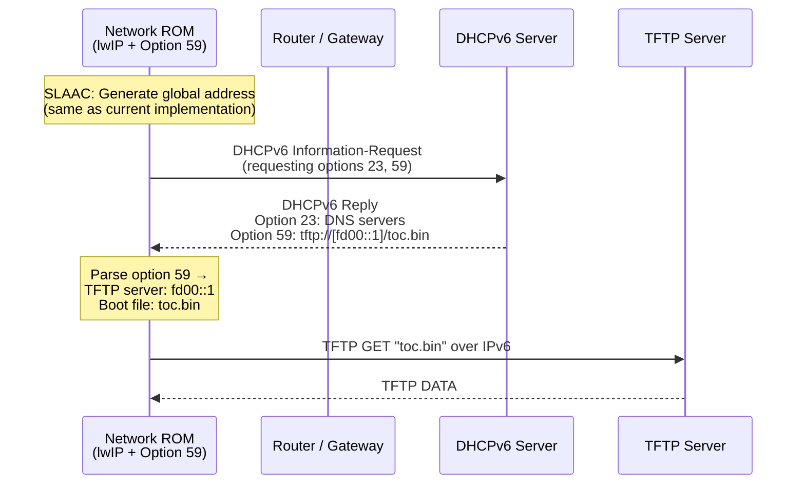
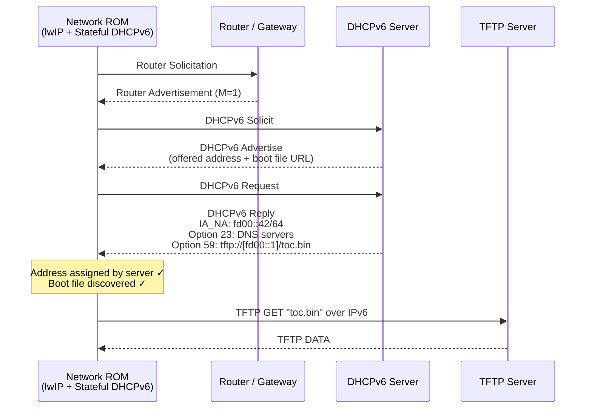

# IPv6 Address Configuration: DHCPv6, Stateless DHCPv6, and SLAAC

This document explains the three primary methods for IPv6 address configuration, their differences, and the current implementation used in the Caliptra network boot subsystem.

## Overview

Unlike IPv4, which relies almost exclusively on DHCP for automatic address configuration, IPv6 provides multiple mechanisms. Understanding the differences is important because each method has trade-offs in terms of what information it can deliver to the client and how much infrastructure is required.

| Feature | SLAAC | Stateless DHCPv6 | Stateful DHCPv6 |
|---|---|---|---|
| Address assignment | Router Advertisement (RA) prefix + host self-generates | Router Advertisement (RA) prefix + host self-generates | DHCPv6 server assigns address |
| DNS server info | No | Yes (via DHCPv6) | Yes (via DHCPv6) |
| Boot file / TFTP server | No | No | Possible (vendor options) |
| Server tracks leases | No | No | Yes |
| Requires DHCPv6 server | No | Yes (lightweight) | Yes (full) |
| RA flags | A=1, O=0, M=0 | A=1, O=1, M=0 | A=0, O=0, M=1 |

### RA Flag Definitions

- **A (Autonomous)**: Prefix can be used for SLAAC address generation.
- **O (Other Configuration)**: Hosts should contact a DHCPv6 server for *other* configuration (e.g., DNS), but not for addresses.
- **M (Managed Address Configuration)**: Hosts should use DHCPv6 to obtain addresses.

---

## 1. SLAAC (Stateless Address Autoconfiguration)

**RFC 4862** — The simplest method. The host generates its own global IPv6 address using a prefix advertised by the router and a self-generated interface identifier (typically derived from the MAC address via EUI-64 or a random value for privacy).

**How it works:**
1. Host generates a link-local address (`fe80::/10` + interface ID).
2. Host sends a Router Solicitation (RS) to `ff02::2` (all-routers multicast).
3. Router responds with a Router Advertisement (RA) containing one or more prefixes with the **A flag** set.
4. Host combines the prefix with its interface ID to form a global address.
5. Host performs Duplicate Address Detection (DAD) to ensure uniqueness.

**Limitations:**
- No DNS server information is provided.
- No boot file or TFTP server information.
- No central record of which addresses are in use.



---

## 2. Stateless DHCPv6 (SLAAC + DHCPv6 for Other Info)

**RFC 3736** — A hybrid approach. The host still obtains its IPv6 address via SLAAC (same as above), but *additionally* contacts a DHCPv6 server to obtain other configuration parameters such as DNS recursive name server addresses and DNS search lists.

The router sets both the **A flag** (for SLAAC) and the **O flag** (for other config via DHCPv6) in its Router Advertisement.

**How it works:**
1. Host performs SLAAC (steps 1–5 above) to get an IPv6 address.
2. Host sees the **O flag** in the RA and sends a DHCPv6 **Information-Request** message to the well-known multicast address **`ff02::1:2`** (All DHCPv6 Relay Agents and Servers) on **UDP port 547**. The host does not need to know the server's address in advance — any DHCPv6 server on the link listening on this multicast group will respond.
3. DHCPv6 server responds with a **Reply** containing DNS servers, search domains, and potentially other options — but **not** an IPv6 address.

**Boot file discovery (PXE boot over stateless DHCPv6):**

In a standard PXE boot environment, the boot file URL *can* be delivered via **DHCPv6 Option 59 (Boot File URL)** defined in **RFC 5970**. This option contains a URI such as `tftp://[2001:db8::1]/pxelinux.0`, providing both the TFTP server address and the filename in a single field. RFC 5970 does not restrict option 59 to stateful exchanges — a DHCPv6 server **can** include it in a Reply to an Information-Request (stateless mode). Servers like ISC DHCP and dnsmasq support this.

However, the **client** must explicitly request and parse option 59. lwIP's stateless DHCPv6 implementation only requests and parses options 23 (DNS servers), 24 (domain search list), and 31 (NTP servers). It does **not** request or parse option 59, which is why the current implementation cannot discover boot file information over IPv6 and must rely on compiled-in fallback values instead.

**Limitations:**
- The DHCPv6 server does **not** assign addresses and does **not** track leases.
- Boot file discovery via option 59 is supported by the protocol but **not by lwIP's client implementation** — the limitation is on the client side, not the protocol.



---

## 3. Stateful DHCPv6

**RFC 8415** — The full DHCPv6 protocol. The DHCPv6 server assigns IPv6 addresses (and optionally prefixes) to the client in a lease-based model, similar to DHCPv4. The server maintains state about which addresses have been assigned.

The router sets the **M flag** in its Router Advertisement to instruct hosts to use DHCPv6 for address assignment.

**How it works:**
1. Host generates a link-local address.
2. Host sends a Router Solicitation; the RA has the **M flag** set.
3. Host initiates a 4-message DHCPv6 exchange:
   - **Solicit** → Host discovers DHCPv6 servers.
   - **Advertise** → Server offers an address and configuration.
   - **Request** → Host requests the offered address.
   - **Reply** → Server confirms the assignment.
4. Host receives an IPv6 address, DNS servers, and potentially vendor-specific options.

**Advantages:**
- Central address management and lease tracking.
- Can carry additional configuration via vendor options.
- Closest model to DHCPv4 (most familiar to administrators).

**Limitations:**
- Requires a full DHCPv6 server maintaining lease state.
- More complex to implement on resource-constrained devices.
- Boot file options (e.g., DHCPv6 option 59 — OPT_BOOTFILE_URL) exist in the standard but are **not widely supported** by lightweight network stacks like lwIP.



---

## Side-by-Side Comparison



---

## Current Implementation: Network Boot for IPv6

The Caliptra network boot subsystem uses **lwIP** (Lightweight IP), a minimal TCP/IP stack designed for embedded and resource-constrained environments.

### lwIP IPv6 Configuration

The following compile-time flags control IPv6 behavior (from `lwipopts.h`):

```c
#define LWIP_IPV6                    1   // IPv6 enabled
#define LWIP_IPV6_AUTOCONFIG         1   // SLAAC enabled
#define LWIP_IPV6_DHCP6              1   // DHCPv6 enabled
#define LWIP_IPV6_DHCP6_STATEFUL     0   // Stateful DHCPv6 DISABLED
#define LWIP_ND6_ALLOW_RA_UPDATES    1   // Process Router Advertisements
#define LWIP_ICMP6                   1   // ICMPv6 (required for ND6)
```

Key takeaway: **`LWIP_IPV6_DHCP6_STATEFUL` is set to `0`**, meaning lwIP only supports stateless DHCPv6. It cannot obtain an IPv6 address from a DHCPv6 server.

> **Important:** Even if `LWIP_IPV6_DHCP6_STATEFUL` were set to `1`, stateful DHCPv6 would **still not work**. lwIP's stateful DHCPv6 is entirely unimplemented — `dhcp6_enable_stateful()` is a stub that prints `"stateful dhcp6 not implemented yet"` and returns `ERR_VAL`. The state machine only has stateless states (`OFF`, `STATELESS_IDLE`, `REQUESTING_CONFIG`); there are no Solicit/Request message handlers, no IA_NA option parsing, and no option 59 (Boot File URL) support. Enabling the flag alone would not provide any stateful functionality.

### How IPv6 Address Assignment Works (Current Implementation)

The implementation uses **SLAAC + Stateless DHCPv6** (`ra-stateless` mode):

1. **Network interface initialization**: lwIP auto-generates a link-local address from the MAC address.
2. **Stateless DHCPv6 enabled**: `netif.dhcp6_enable_stateless()` is called, which enables DHCPv6 for DNS resolution only.
3. **Router Solicitation / Advertisement**: lwIP's ND6 module automatically sends RS messages; the router responds with an RA containing the network prefix (e.g., `fd00:1234:5678::/64`) with the **A flag** set for SLAAC and the **O flag** set for stateless DHCPv6.
4. **SLAAC address generation**: lwIP combines the advertised prefix with the interface identifier to form a global IPv6 address.
5. **Polling until ready**: The firmware polls `netif.has_global_ipv6_address()` until a global address is available.



### How Boot File Information Is Obtained

This is the **key limitation** of the current IPv6 implementation:

- **IPv4 (DHCPv4)**: The TFTP server address and boot file name are embedded in the DHCP response itself — either via BOOTP header fields (`siaddr` and `file`) or DHCP options 66 (TFTP server) and 67 (boot file name). This is well-supported by lwIP.

- **IPv6 (Stateless DHCPv6)**: DHCPv6 option 59 (`OPT_BOOTFILE_URL`, RFC 5970) can carry boot file information and is not restricted to stateful exchanges — a server *can* include it in a stateless Reply. However, lwIP's DHCPv6 client does not request or parse option 59 (it only handles options 23, 24, and 31). Additionally, lwIP's stateful DHCPv6 is completely unimplemented (stub only), so neither stateless nor stateful paths provide boot file discovery.

As a result, **the IPv6 boot path uses hardcoded fallback values** for the TFTP server address and boot file name:

```rust
fn run_dhcp_v6(
    max_iterations: u32,
    fallback_server: Ipv6Addr,       // ← Hardcoded / compiled-in
    fallback_boot_file: &[u8],       // ← Hardcoded / compiled-in
) -> Result<DhcpResult, NetworkError> { ... }
```

The dual-stack boot flow tries DHCPv4 first, and only falls back to IPv6 if DHCPv4 times out:



### Summary of Current Limitations

1. **No stateful DHCPv6 support**: lwIP is compiled with `LWIP_IPV6_DHCP6_STATEFUL = 0`, and even enabling this flag would not help — stateful DHCPv6 is entirely unimplemented in lwIP (the enable function is a stub that returns an error). The device cannot receive an IPv6 address from a DHCPv6 server.

2. **No boot file discovery over IPv6**: lwIP's DHCPv6 client does not request or parse option 59 (Boot File URL, RFC 5970). While the protocol allows option 59 in both stateless and stateful exchanges, lwIP only parses DNS (option 23), domain search list (option 24), and NTP (option 31). The TFTP server and boot file name must be provided as compiled-in fallback values.

3. **IPv6 is a fallback only**: The current boot flow always attempts DHCPv4 first. IPv6 is only used when DHCPv4 is unavailable.

### Options for Supporting IPv6 Network Boot

To move beyond hardcoded fallback values and support dynamic boot file discovery over IPv6, there are two primary options — plus a lighter-weight alternative:

#### Option 1: Stateless DHCPv6 + Add Option 59 Parsing to lwIP (Recommended)

Keep the current SLAAC-based address assignment and extend lwIP's stateless DHCPv6 client to request and parse **option 59 (Boot File URL, RFC 5970)**.

| Aspect | Details |
|---|---|
| **Address assignment** | SLAAC (already working, no changes needed) |
| **Boot file discovery** | Add option 59 to `requested_options[]` in `dhcp6_information_request()` and add a case in the option parser to extract the boot file URL |
| **Server-side changes** | Configure dnsmasq/ISC DHCP to include option 59 in stateless replies (both already support this) |
| **Scope of lwIP changes** | Small — add ~50–100 lines to `dhcp6.c` (option request + parsing) plus corresponding Rust bindings |
| **What you get** | Dynamic TFTP server + boot file discovery via standard DHCPv6, matching DHCPv4 functionality |
| **What you don't get** | Centralized address management (SLAAC addresses are self-generated, no lease tracking) |



#### Option 2: Implement Full Stateful DHCPv6 in lwIP

Implement the complete stateful DHCPv6 client (Solicit/Advertise/Request/Reply) from scratch in lwIP, plus option 59 parsing.

| Aspect | Details |
|---|---|
| **Address assignment** | Server-assigned via DHCPv6 (IA_NA) |
| **Boot file discovery** | Option 59 in DHCPv6 Reply (must also be implemented) |
| **Scope of lwIP changes** | Major — implement the 4-message state machine, IA_NA/IAADDR option parsing, DUID generation, lease renewal/rebind timers. Estimated hundreds of lines of new C code plus Rust bindings |
| **What you get** | Full parity with DHCPv4: server-assigned address + boot file discovery + centralized lease management |
| **What you don't get** | Simplicity — significantly increases ROM size and code complexity on a resource-constrained network coprocessor |



#### Option 3: DNS-Based TFTP Discovery (No lwIP DHCPv6 Changes)

Use the DNS server already obtained via stateless DHCPv6 to resolve a well-known hostname for the TFTP server, combined with a naming convention for the boot file.

| Aspect | Details |
|---|---|
| **Address assignment** | SLAAC (no changes) |
| **Boot file discovery** | Resolve a well-known hostname (e.g., `tftp.boot.local`) via DNS to get the TFTP server address; use a convention for the boot file name |
| **Scope of lwIP changes** | None — lwIP already has DNS client support |
| **Server-side changes** | Add a DNS A/AAAA record for the well-known hostname |
| **Tradeoff** | Requires DNS infrastructure and a naming convention; less standard than option 59 |

#### Recommendation

**Option 1** is the pragmatic choice. SLAAC already provides a working IPv6 address, and option 59 parsing is a small, targeted change to lwIP's existing stateless DHCPv6 code. It eliminates the need for hardcoded fallback values without the complexity of a full stateful DHCPv6 implementation. Option 2 only makes sense if centralized IPv6 address management is independently required.
