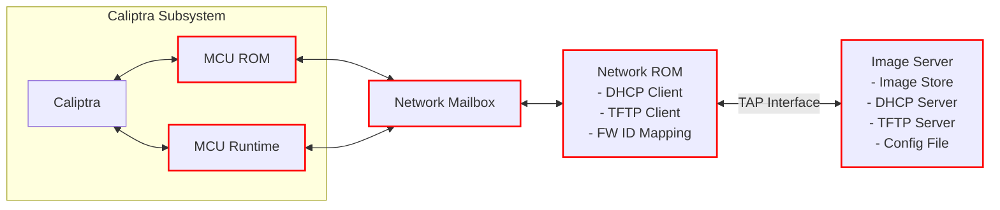

# [RFC] Caliptra MCU Network Recovery Boot

## Abstract
The Caliptra subsystem network recovery boot is designed for systems that integrate the Caliptra subsystem and use flash as the primary boot source. When both flash partitions are corrupted and no local boot path remains viable, network recovery provides an automated fallback to restore the system to a bootable state — without requiring physical intervention that is costly and impractical in hyperscale data center environments.

This RFC proposes a lightweight network recovery boot mechanism that enables the Caliptra subsystem to download firmware images over the network. The MCU ROM fetches firmware through a generic BootSourceProvider trait that abstracts the underlying boot source — whether flash, network, or USB. For network recovery, a Network Boot Coprocessor is provided as a reference implementation of a network-based boot source provider. The Network Boot Coprocessor runs within a minimal ROM environment and **operates outside the native Caliptra subsystem boundary**. It acts as an intermediary between remote image servers and the Caliptra subsystem, handling network configuration, server discovery, and firmware image downloads for multiple firmware components (Caliptra FMC+RT, SoC Manifest, MCU Runtime, and SoC images) through a firmware ID-based mapping system.

The recovery boot proceeds in two stages:
- **Stage 1 (ROM):** The MCU ROM uses the `BootSourceProvider` to fetch early firmware (Caliptra FMC+RT, SoC Manifest, MCU RT) and streams them to the Caliptra Recovery Interface. The early firmware image authentication stays the same as the existing streaming boot model.
- **Stage 2 (Runtime):** The MCU Runtime fetches remaining SoC images, loads them to their designated addresses, and authorizes each image through Caliptra RT.

## Scope

### Components Affected

*Red boxes indicate components affected by this change.*

- **MCU ROM**: The MCU ROM boot flow is updated to accept an ordered array of `BootSourceProvider` trait implementations. During boot, the ROM iterates through the array and attempts each provider in order — the first provider is the flash-based boot source, and if it fails (e.g., both flash partitions are corrupted), the ROM falls back to the next provider in the array (e.g., network). The network `BootSourceProvider` implementation communicates with the Network Boot Coprocessor through a shared communication interface (e.g., a mailbox), exchanging messages via a defined messaging protocol to request and receive firmware images. Additionally, the ROM includes optional flash write-back logic: when a network recovery succeeds, the recovered images can be staged to flash and committed, restoring the flash to a bootable state for subsequent reboots.

- **MCU Runtime**: Similar to the MCU ROM, the MCU Runtime loads SoC images through a `BootSourceProvider` implementation. During Stage 2 boot, if the flash is invalid, the image loading module uses the network `BootSourceProvider` to fetch SoC images from the network instead of flash. Fetched images are loaded to their designated memory addresses and authorized through Caliptra RT. The Runtime also implements flash write-back staging and commit for the remaining firmware images recovered over the network.

- **Network Boot Coprocessor (Network ROM)**: A new component, operating outside the Caliptra subsystem boundary, that provides a reference implementation of a network-based boot source. The Network CoP integrates the lwIP C network stack, with Rust bindings wrapping the lwIP APIs so that the CoP's Rust application code can use them. The software architecture consists of:
  - **Application Layer**: Responsible for communication with the MCU (via the mailbox messaging protocol) and orchestrating DHCP/TFTP operations to discover servers and download firmware images.
  - **lwIP Network Stack**: Provides the TCP/IP stack including DHCP client and TFTP client functionality, built from C sources with Rust FFI bindings.
  - **Drivers**: UART (debug logging), Ethernet (network I/O), and Mailbox (MCU communication) drivers.

- **Emulator**: The emulator is extended with a new RISC-V CPU instance for the Network Boot Coprocessor. The Network CoP CPU is connected to the following peripherals:
  - **Ethernet Peripheral**: Emulated NIC that communicates with external DHCP/TFTP servers through a TAP interface on the host.
  - **Network Mailbox**: Shared communication interface between the MCU and the Network CoP for exchanging boot source messages.
  - **UART**: Debug output for the Network CoP firmware.

  These peripherals are connected to the Caliptra SS AXI Bus (actual HW implementation is pending).

- **Build System and Integration Tests**:
  1. **C-to-Rust Bindings**: `libclang-dev` is added as a build dependency to support generating Rust FFI bindings for the lwIP C sources.
  2. **xtask Commands (Build)**: New xtask commands are added to build and package the Network CoP RISC-V firmware.
  3. **xtask Commands (Test Infrastructure)**: New xtask commands are added to set up the TAP interface and to configure `dnsmasq` (used as a lightweight DHCP/TFTP server for integration testing).
  4. **Integration Tests**: End-to-end network recovery boot tests using the emulated environment with DHCP and TFTP servers provided by `dnsmasq`.

- **TOC (Table of Contents)**: The TOC format for the flash image is updated to accommodate network boot. The TOC is shared between flash and network boot modes. A new field is added to each TOC entry to specify the filename of the image, which is used as the TFTP download path during network recovery.

### Components Not Affected

- **Caliptra Core**: No changes to Caliptra ROM or RT firmware. The recovery interface and authorization flows are used as-is.
- **Existing Flash Boot Path**: The normal flash-based boot path is unchanged. Network recovery is a fallback invoked only when flash boot fails.

### Protocol Stack (Network Boot Coprocessor)

The following protocols are implemented within the Network Boot Coprocessor, which operates outside the Caliptra subsystem boundary:

- **DHCP (DHCPv4 / DHCPv6)**: Automatic network configuration — IP address, gateway, and boot server discovery. DHCPv4 Options 66/67 and DHCPv6 Options 59/60 are used for TFTP server and bootfile discovery.
- **TFTP**: Lightweight UDP-based file transfer for downloading the TOC configuration file and firmware images. Minimal code footprint (~5–10 KB) suitable for ROM environments.
- **IPv4 / IPv6 Dual-Stack**: Full dual-stack support throughout discovery and transfer. Prefer IPv6 when available; fall back to IPv4.

## Rationale

- **Flash Dependency Risk**: The current architecture has no automated recovery if both flash partitions are corrupted. This is a single point of failure for boot.
- **Hyperscale Recovery Cost**: Physical intervention (e.g., re-flashing via JTAG or board swap) is prohibitively expensive in large-scale deployments. An in-band network recovery path eliminates this cost.
- **Minimal ROM Footprint**: The design uses a dedicated coprocessor with a lightweight network stack (lwIP) rather than adding network capability to the MCU ROM itself, keeping the ROM small and auditable.
- **Consistency with OCP Streaming Boot**: The approach aligns with the OCP streaming boot model for early firmware delivery, using standard protocols (DHCP + TFTP) that are well-understood in data center infrastructure.
- **Generic Boot Source Abstraction**: The `BootSourceProvider` trait decouples the MCU ROM from the specific boot source implementation, enabling future boot sources (e.g., USB, BMC-assisted) without ROM changes.
- **Flash Write-Back Reduces Re-Recovery**: Without flash write-back, every reboot after a network recovery would require another network recovery. The optional staging-and-commit flow restores the flash to a bootable state, making the recovery self-healing.

## Design Overview

For the full design details — including boot flow diagrams, messaging protocol packet formats, `BootSourceProvider` trait definition, flash write-back configuration, and network stack implementation — see the [Network Recovery Boot Design Document](https://github.com/chipsalliance/caliptra-mcu-sw/blob/main/docs/src/network_boot.md).

## Maintenance

- **Unit Tests**: Tests for the `BootSourceProvider` trait implementation, message serialization/deserialization, firmware ID mapping, and TOC parsing.
- **Integration Tests**: End-to-end network recovery boot tests using an emulated network environment with DHCP and TFTP servers, covering:
  - Successful Stage 1 and Stage 2 recovery boot.
  - Flash write-back with both commit policies.
  - Error cases: DHCP timeout, TFTP failure, checksum mismatch, image not found, staging write failure.
  - IPv4-only, IPv6-only, and dual-stack configurations.
- **Emulator Support**: The existing emulator infrastructure will be extended with network boot coprocessor emulation for CI/CD testing.
- **Error Handling Verification**: Tests for all defined error codes (0x00–0xFF), ensuring graceful degradation — flash write-back failures must not block the primary recovery path.
